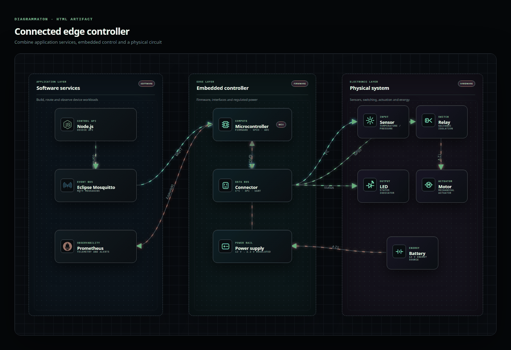

# Diagrammaton

---

Diagrammaton is an HTML-first editor for rich, animated technical diagrams.

- Start from layered system-landscape and decision-workflow compositions.
- Combine semantic DOM components: platforms, boundaries, services, data stores, actors, actions, cards, and metrics.
- Add locally embedded technology logos for databases, DevOps, messaging, cloud, observability, and application runtimes.
- Combine software architecture with 20 reusable electronic symbols, including microcontrollers, sensors, buses, relays, motors, semiconductors, passive components, and power rails.
- Connect components with curved, orthogonal, straight, animated, dashed, or bidirectional routes.
- Edit labels, badges, capabilities, colors, positions, and dimensions without drawing individual primitives.
- Zoom through large compositions while keeping every component and connector crisp.
- Export a self-contained HTML document with its styles and motion embedded.
- Download an animated GIF captured directly from the semantic HTML/SVG stage, including local technology and electronic icons.
- Switch between English and French and four visual themes while working.

Diagram nodes are real HTML elements. SVG is deliberately limited to the connector layer, giving the editor the expressive layout of a web document without sacrificing precise routes.

The component library currently includes more than 100 vector technology marks covering databases, delivery platforms, messaging, observability, cloud providers, languages, and frameworks. Brand vectors come from the CC0-licensed Simple Icons package and remain embedded in standalone HTML exports.

---

## See Diagrammaton in action



---

## Quickstart

### Install

```bash
npm install
```

### Run

```bash
npm run dev
```

### Validate

```bash
npm test
npm run build
```

The full test gate combines Vitest domain/export tests with Playwright browser and visual-regression tests. Contributors and coding agents must keep iterating until both suites and the production build pass; the detailed contract lives in `AGENTS.md`.
