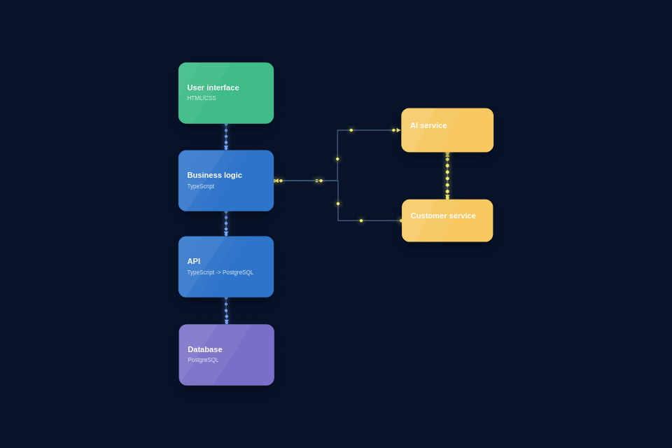

# Diagrammaton

---

Diagrammaton is a visual editor for building animated diagrams.
Start with an empty canvas and arrange the blocks yourself.
Connect blocks with straight, orthogonal, or bidirectional links.
Use animated flows to explain software, construction, or electrical ideas.
Edit block titles, descriptions, colors, positions, and dimensions.
Copy and paste blocks while shaping a diagram.
Preview the complete composition directly in the editor.
Export the finished diagram as a fluid animated GIF.
Switch between English and French while working.
Choose a background theme that fits the diagram.

---

## See Diagrammaton in action



---

## Quickstart

### Install

```bash
npm install
```

### Run

```bash
npm run dev
```
