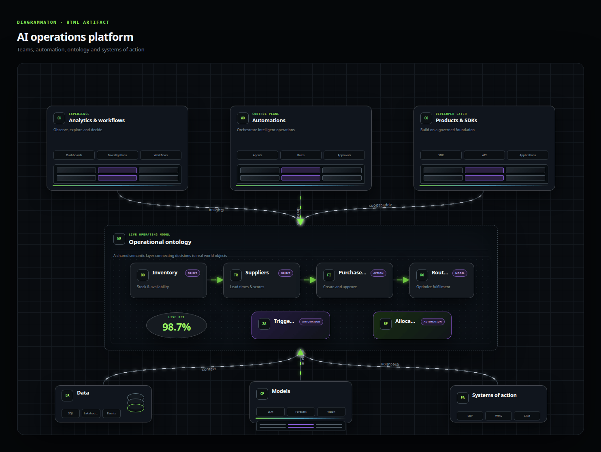
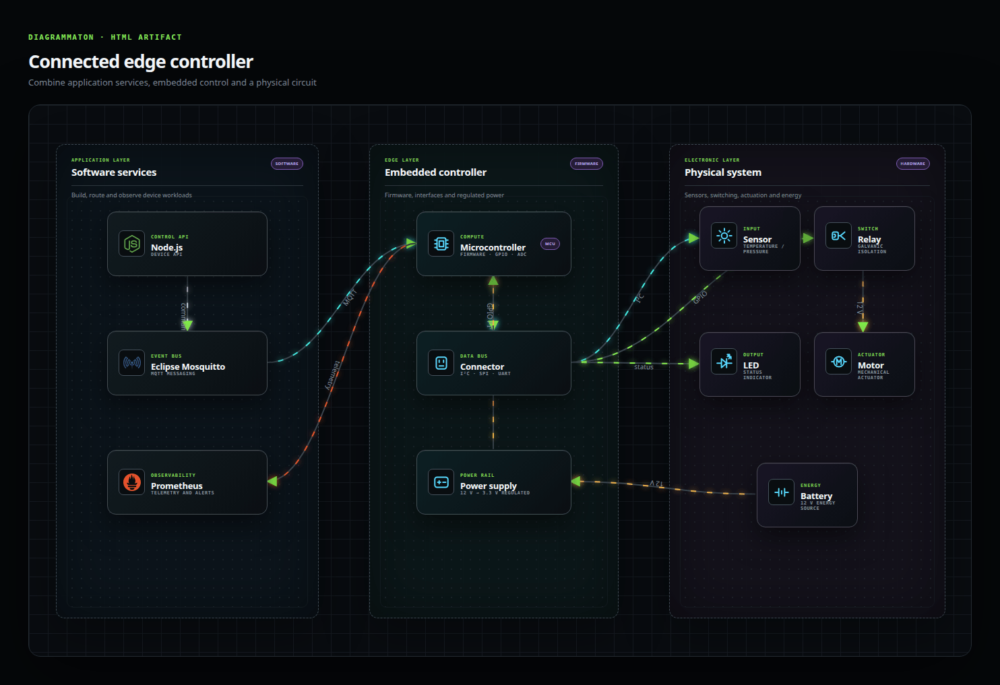

# Diagrammaton

---

Diagrammaton is an HTML-first editor for rich, animated technical diagrams.

- Start from layered system-landscape and decision-workflow compositions.
- Combine semantic DOM components: platforms, boundaries, services, data stores, actors, actions, cards, and metrics.
- Add locally embedded technology logos for databases, DevOps, messaging, cloud, observability, and application runtimes.
- Combine software architecture with 40 reusable electronic symbols, including microcontrollers, sensors, buses, relays, motors, semiconductors, passive components, and power rails.
- Add local logos for AI, agentic and RAG stacks including LangChain, Hugging Face, Ollama, ONNX, PyTorch, TensorFlow, Gemini, Anthropic and Mistral AI.
- Connect components with curved, orthogonal, straight, animated, dashed, or bidirectional routes.
- Edit labels, badges, capabilities, colors, positions, and dimensions without drawing individual primitives.
- Zoom through large compositions while keeping every component and connector crisp.
- Download a self-contained HTML document first, followed by its animated GIF companion.
- Render the exported HTML with a local TypeScript Playwright/Sharp service for high-fidelity, compact GIFs.
- Switch between English and French and four visual themes while working.

Diagram nodes are real HTML elements. SVG is deliberately limited to the connector layer, giving the editor the expressive layout of a web document without sacrificing precise routes.

The component library currently includes more than 100 vector technology marks covering databases, delivery platforms, messaging, observability, cloud providers, languages, and frameworks. Brand vectors come from the CC0-licensed Simple Icons package and remain embedded in standalone HTML exports.

---

## See Diagrammaton in action




---

## Quickstart

### Install

```bash
npm install
```

### Run

```bash
npm run dev
```

The TypeScript-based GIF rendering engine is integrated into Vite’s development and preview servers, so no additional process is required. The editor first loads the standalone HTML file and then requests the corresponding optimized GIF. The process prioritizes the HTML: Chromium generates 60 frames over a six-second period, after which Sharp merges identical frames, creates a shared 128-color palette, and compresses areas that have changed between frames.

Compression takes some time during the download—sometimes up to a minute—but results in a lightweight output GIF.

For production deployments serving only the static version generated by Vite, the `npm run gif:service` command launches this same rendering engine on `127.0.0.1:8000`; you simply need to redirect requests to `/api/gif` from the public web server.
